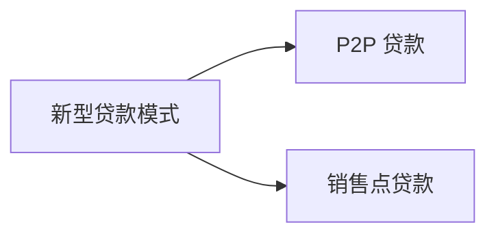
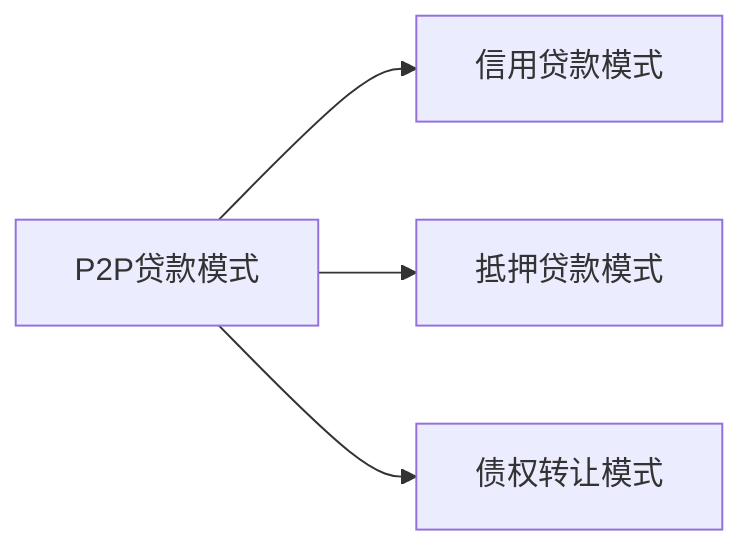

# Chapter 2

## 贷款模式

## P2P 贷款模式（Peer-to-Peer Lending）

### 1. P2P 贷款的运作模式

P2P 网贷平台充当**信息中介**，主要提供**撮合交易**、**风险评估**和**资金管理**等服务，具体流程如下：

1. **借款人申请贷款**

   - 借款人在 P2P 平台注册，并提交身份信息、信用记录、收入证明等资料。
   - 平台对借款人进行**信用评估**，决定其贷款额度和利率。

2. **投资人出资**

   - 投资人（出借人）在平台上注册并充值资金。
   - 可选择**自主投资**或**自动投标**。

3. **资金撮合**

   - P2P 平台将投资人的资金分配给符合条件的借款人。
   - 借款人获得资金后，需按约定**分期还款**。

4. **还款与收益**
   - 借款人按期归还本息。
   - 投资人获得利息收益，P2P 平台可能会收取一定的**管理费**。

---

### 2. P2P 贷款的主要模式

#### （1）信用贷款模式

- 借款人**无抵押**，纯信用借款。
- 代表平台：LendingClub（美国），早期的拍拍贷（中国）。

#### （2）抵押贷款模式

- 借款人提供**抵押物**（如房产、汽车）。
- 代表平台：陆金所（中国曾有，现已清退）。

#### （3）债权转让模式

- 贷款发放后，投资人可以**转让债权**，增加资金流动性。

---

### 3. P2P 贷款的优缺点

#### ✅ **优势**

- **低门槛**：无银行贷款资格的借款人也可贷款。
- **高收益**：利息回报通常高于银行存款。
- **便捷快速**：全程线上操作，放款速度快。

#### ❌ **风险**

- **信用风险**：借款人逾期不还，投资人损失。
- **平台跑路**：部分 P2P 平台涉嫌**资金池**或**自融**，导致非法集资。
- **监管政策变化**：中国已全面取缔 P2P 网贷。

---

##  销售点贷款模式（Point-of-Sale Lending, POS Lending）

销售点贷款（POS Lending）是一种**基于消费场景的分期贷款模式**，允许消费者在**购买商品或服务时**直接申请贷款，通常由**银行、金融机构或金融科技公司**提供。消费者可以**分期付款**，而商家**即时收到全款**。

---

### 2. 销售点贷款的运作流程
#### **（1）消费者购物**
- 在**电商平台、实体店、在线商城**等消费场景下选择商品或服务。

#### **（2）申请贷款**
- 付款时选择**分期付款**或**POS贷款**选项。
- 由银行、P2P平台、第三方支付机构提供信贷支持。

#### **（3）贷款审批**
- 消费者填写申请，提供**身份信息**、**信用记录**等。
- 贷款提供方进行**信用评估**，决定是否批准贷款。

#### **（4）商家收到全款**
- 贷款机构**立即支付全额**给商家，消费者无需支付全款。

#### **（5）消费者按期还款**
- 消费者按**分期计划**逐步偿还贷款本金+利息（或无息）。
- 逾期未还可能影响信用记录，并产生额外费用。

---

### 3. 销售点贷款的主要模式
#### **（1）银行POS分期**
- 由**银行提供贷款**，适用于**大额消费**（如家电、手机、旅游）。
- 代表机构：工商银行、中国建设银行、招商银行。

#### **（2）金融科技公司POS贷款**
- 由**互联网金融公司**提供贷款，审批更快，额度较灵活。
- 代表平台：蚂蚁花呗（支付宝）、京东白条、WeLab（香港）。

#### **（3）BNPL（先买后付）模式**
- 近年兴起的**无息分期付款**模式，类似信用卡，但无须银行账户。
- 代表平台：Affirm（美国）、Klarna（欧洲）、Afterpay（澳大利亚）。

---

## 4. 销售点贷款的优缺点
### ✅ **优势**
1. **提升消费能力**：用户可**先消费，后付款**，降低购物门槛。
2. **审批快速**：相比传统银行贷款，POS贷款**审批更快**，甚至秒批。
3. **灵活分期**：提供**3/6/12/24期**等分期选择，利息低或免息。
4. **促进商家销售**：商家能更容易成交，提高客单价。

### ❌ **风险**
1. **超前消费风险**：消费者可能因**分期过多**而**债务负担过重**。
2. **逾期影响信用**：未按时还款可能影响**个人信用记录**。
3. **隐形费用**：部分平台虽标榜**免息分期**，但可能有**手续费**或**服务费**。
4. **欺诈与风控**：如果风控不足，容易导致**坏账率上升**。

---

