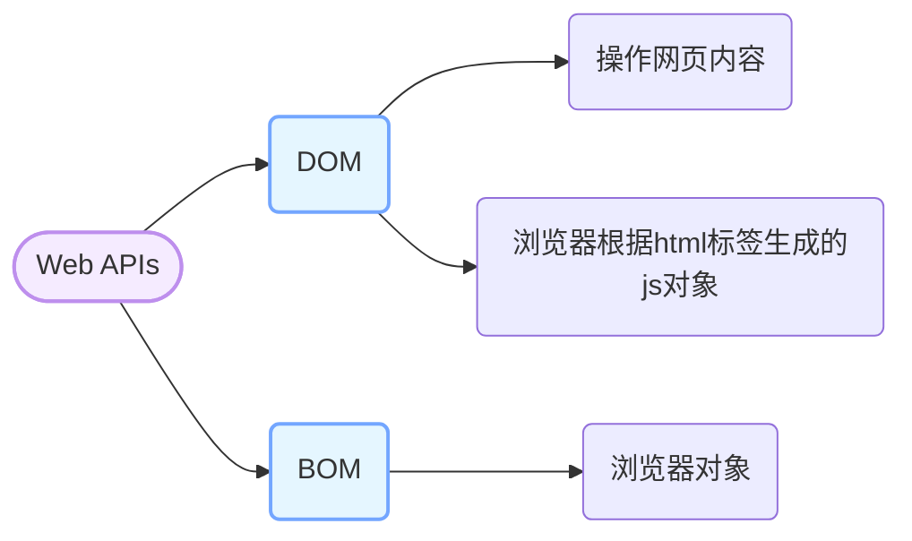
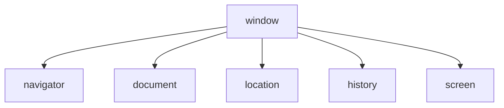
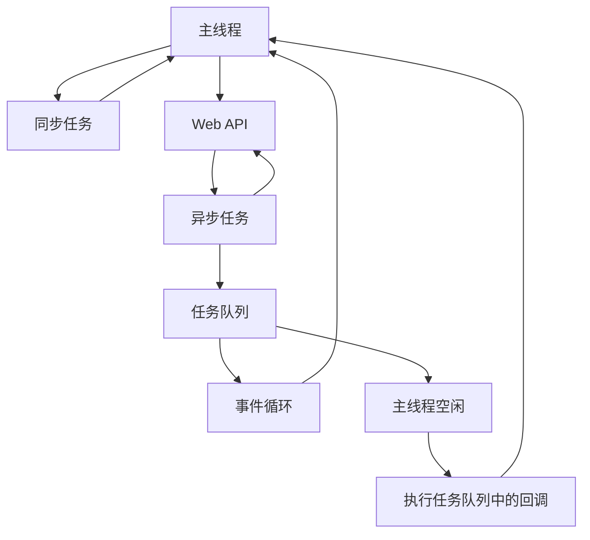

# Web APIs

Web APIs 分为 DOM（文档对象类型）和 BOM（浏览器对象类型）





## DOM

DOM 是浏览器根据 html 标签生成的 js 对象

```html
<div>123</div>
<script>
    const div = document.querySelector('div')
    console.log(div) // 123   dom对象
  console.dir()可以查看对象的所有属性和方法
</script>
```

### 获取 dom 元素

```js
document.querySelector();
document.querySelectorAll();
// 根据id获取一个元素
document.getElementById("nav");
// 根据标签名获取一类元素 获取页面所有div
document.getElementsByTagName("div");
// 根据类名获取元素 获取页面所有类名为w的元素
document.getElementsByClassName("w");
```

### 修改 dom 元素

#### innerText

纯文本，会忽略标签不解析

#### innerHTML

html 标签，会解析标签

### 控制样式属性

#### 修改样式属性

通过元素节点获得的 `style` 属性本身的数据类型也是对象，如 `box.style.color`、`box.style.width` 分别用来获取元素节点 CSS 样式的 `color` 和 `width` 的值。

任何标签都有 `style` 属性，通过 `style` 属性可以动态更改网页标签的样式，如要遇到 `css` 属性中包含字符 `-` 时，要将 `-` 去掉并将其后面的字母改成大写，如 `background-color` 要写成 `box.style.backgroundColor`

#### 修改样式类名

> 1.由于 class 是关键字, 所以使用 className 去代替
>
> 2.className 是使用新值换旧值, 如果需要添加一个类,需要保留之前的类名
>
> 3.  通过 classList 操作类控制 CSS 样式，为了解决 className 容易覆盖以前的类名，可以通过 classList 方式追加和删除类名

```html
<style>
  .pink {
    color: pink;
  }
  .box {
    width: 200px;
    height: 200px;
    background-color: skyblue;
  }
</style>
<div class="box">随便一些文本内容</div>
<script>
  // 获取 DOM 节点
  const box = document.querySelector(".intro");
  box.className = "pink";
  // 如果有两个类名
  box.className = "pink box";
  // 想要添加一个类名, 保留之前的类名
  box.className += " box";

  // 通过 classList 操作类控制CSS样式,类名不加点，直接写类名字符串
  // 追加类名
  box.classList.add("pink");
  // 删除类名
  box.classList.remove("box");
  // 切换类名，如果有就删除，没有就添加
  box.classList.toggle("box");
</script>
```

## BOM

BOM 是浏览器对象类型，它提供了对浏览器窗口和框架进行访问的对象。

所有通过 var 定义的变量都是全局变量

## 表单

### 操作表单元素属性

获取:DOM 对象.属性名

设置:DOM 对象.属性名= 新值

存在隐式转换，表单属性只接受布尔值

> disabled:禁用
>
> checked:选中
>
> value:值

`<button>` 标签获取值用 .innerHTML
`<input>` 标签获取值用.value
`<li>` 索引从 1 开始

### 自定义属性

data-属性名

在标签上一律以 data-开头

在 DOM 对象上一律以 dataset 对象方式获取

## 定时器-间歇函数

`setInterval` 是 JavaScript 中内置的函数，它的作用是间隔固定的时间自动重复执行另一个函数，也叫定时器函数。

开启定时器

```js
setInterval(函数, 间隔时间);
// 1
setInterval(function () {
  // 要执行的代码
}, 间隔时间);

// 2
function fn() {
  // 要执行的代码
}
setInterval(fn, 间隔时间);
```

作用：每隔指定的时间就会自动执行一次函数，间隔时间单位是毫秒

关闭定时器

```js
定时器变量名 = setInterval(函数, 间隔时间);
clearInterval(定时器变量名);
```

作用：关闭定时器，参数是定时器变量名

## 定时器-延时函数

`setTimeout` 是 JavaScript 中内置的函数，它的作用是在指定的时间后执行另一个函数，也叫定时器函数.平时只执行一次，省略 window

开启定时器

```js
setTimeout(回调函数, 等待的毫秒数);
```

清楚延时函数

```js
let timer = setTimeout(函数, 等待的毫秒数);
clearTimeout(timer);
```

```js
// 1
setTimeout(function () {
  // 要执行的代码
}, 时间);

// 2
function fn() {}
setTimeout(fn, 时间);
```

作用：在指定的时间后执行一次函数，时间单位是毫秒

## 事件监听

事件监听是一种常见的编程模式，用于在特定事件发生时执行特定的代码块。它可以用于响应用户的交互、网络请求的完成、定时器的触发等各种情况。

**事件监听三要素：**

1. 事件源：触发事件的对象，如按钮、输入框等。
2. 事件类型：触发的事件类型，如点击、输入、滚动等。
3. 事件处理函数：当事件发生时要执行的代码块。

```js
DOM对象.addEventListener(事件类型, 事件处理函数);
```

addListener 方法可以绑定多次，拥有事件更多特性。

### 事件类型

事件类型是指触发事件的类型，如点击、输入、滚动等。

#### 鼠标事件-鼠标触发

| 事件类型   | 描述         |
| ---------- | ------------ |
| click      | 鼠标左键点击 |
| dblclick   | 鼠标左键双击 |
| mousedown  | 鼠标左键按下 |
| mouseup    | 鼠标左键抬起 |
| mouseover  | 鼠标移入     |
| mouseout   | 鼠标移出     |
| mousemove  | 鼠标移动     |
| mouseenter | 鼠标移入元素 |
| mouseleave | 鼠标移出元素 |

> mouseenter 和 mouseleave 事件不会冒泡，不会触发父元素的事件处理函数。即只对本身元素有效。
>
> mouseover 和 mouseout 事件会冒泡，会触发父元素的事件处理函数。即只要经过父元素或者子元素都会触发事件处理函数。

#### 焦点事件-表单获得光标

| 事件类型 | 描述     |
| -------- | -------- |
| focus    | 获得焦点 |
| blur     | 失去焦点 |

#### 键盘事件-键盘触发

| 事件类型 | 描述               |
| -------- | ------------------ |
| keydown  | 键盘按键按下       |
| keyup    | 键盘按键抬起       |
| keypress | 键盘按键按下并释放 |

#### 文本事件-表单输入触发

| 事件类型 | 描述     |
| -------- | -------- |
| input    | 文本输入 |
| change   | 文本改变 |
| select   | 文本选中 |
| submit   | 表单提交 |
| reset    | 表单重置 |

#### 窗口事件-窗口触发

| 事件类型 | 描述         |
| -------- | ------------ |
| load     | 页面加载完成 |
| unload   | 页面卸载     |
| resize   | 窗口大小改变 |
| scroll   | 窗口滚动     |

#### 媒体事件-媒体触发

| 事件类型       | 描述               |
| -------------- | ------------------ |
| play           | 媒体播放           |
| pause          | 媒体暂停           |
| ended          | 媒体播放结束       |
| timeupdate     | 媒体播放时间更新   |
| volumechange   | 媒体音量改变       |
| canplay        | 媒体可以播放       |
| canplaythrough | 媒体可以播放到结尾 |
| waiting        | 媒体等待           |
| seeking        | 媒体正在查找       |
| seeked         | 媒体查找完成       |
| error          | 媒体错误           |
| abort          | 媒体中止           |
| loadedmetadata | 媒体元数据加载完成 |
| loadeddata     | 媒体数据加载完成   |
| loadstart      | 媒体加载开始       |
| durationchange | 媒体时长改变       |
| ratechange     | 媒体播放速率改变   |
| resize         | 媒体大小改变       |

### 事件对象

事件对象是指触发事件时，浏览器会自动创建的一个对象，包含了事件的相关信息，如事件类型、事件源、事件坐标等。

事件对象是一个特殊的对象，它包含了事件的相关信息，如事件类型、事件源、事件坐标等。事件对象是由浏览器自动创建的，不需要我们手动创建。

```javascript
元素.addEventListener(事件类型, function (事件对象) {
  // 事件处理函数
});
```

事件对象的属性和方法：

| 属性                       | 描述                       |
| -------------------------- | -------------------------- |
| type                       | 事件类型                   |
| target                     | 事件源                     |
| currentTarget              | 当前事件目标               |
| preventDefault()           | 阻止默认行为               |
| stopPropagation()          | 阻止事件冒泡               |
| stopImmediatePropagation() | 阻止事件冒泡和默认行为     |
| getModifierState()         | 获取修饰键状态             |
| isTrusted                  | 是否由用户触发             |
| timeStamp                  | 事件发生的时间戳           |
| pageX                      | 鼠标相对于页面的 X 坐标    |
| pageY                      | 鼠标相对于页面的 Y 坐标    |
| clientX                    | 鼠标相对于客户端的 X 坐标  |
| clientY                    | 鼠标相对于客户端的 Y 坐标  |
| screenX                    | 鼠标相对于屏幕的 X 坐标    |
| screenY                    | 鼠标相对于屏幕的 Y 坐标    |
| key                        | 键盘按键的键值             |
| code                       | 键盘按键的键码             |
| keyCode                    | 键盘按键的键值             |
| charCode                   | 键盘按键的字符码           |
| which                      | 键盘按键的键值             |
| altKey                     | 是否按下 Alt 键            |
| ctrlKey                    | 是否按下 Ctrl 键           |
| shiftKey                   | 是否按下 Shift 键          |
| metaKey                    | 是否按下 Meta 键           |
| detail                     | 鼠标滚轮滚动的距离         |
| data                       | 文本输入的数据             |
| value                      | 表单元素的值               |
| checked                    | 复选框是否选中             |
| selected                   | 下拉框是否选中             |
| rows                       | 文本框的行数               |
| cols                       | 文本框的列数               |
| width                      | 媒体元素的宽度             |
| height                     | 媒体元素的高度             |
| volume                     | 媒体元素的音量             |
| rate                       | 媒体元素的播放速率         |
| currentTime                | 媒体元素的当前播放时间     |
| duration                   | 媒体元素的总时长           |
| paused                     | 媒体元素是否暂停           |
| ended                      | 媒体元素是否播放结束       |
| seeking                    | 媒体元素是否正在查找       |
| seekable                   | 媒体元素是否可以查找       |
| buffered                   | 媒体元素已经缓冲的时间范围 |
| networkState               | 媒体元素的网络状态         |
| readyState                 | 媒体元素的准备状态         |

### 环境对象

环境对象是指触发事件时，浏览器会自动创建的一个对象，包含了事件的相关信息，如事件类型、事件源、事件坐标等。

指的是函数内部特殊的变量 this，代表当前函数运行时所处的环境

### 回调函数

回调函数是指在一个函数中调用另一个函数，被调用的函数就是回调函数。回调函数通常用于异步操作，如定时器、事件监听、ajax 请求等。

回调函数的优点是可以将代码分离，提高代码的可读性和可维护性。

```javascript
function fn(callback) {
  console.log("我是回调函数");
}
setInterval(fn, 1000);
```

## 事件流

事件流是对事件执行过程的描述，了解事件的执行过程有助于加深对事件的理解，提升开发实践中对事件运用的灵活度。

任意事件被触发时总会经历两个阶段：【捕获阶段】和【冒泡阶段】。

简言之，捕获阶段是【从父到子】的传导过程，冒泡阶段是【从子向父】的传导过程。

```javascript
addEventListener(事件类型, 事件处理函数, 是否在捕获阶段执行);
```

### 捕获和冒泡

捕获阶段：从父元素到子元素的过程。

冒泡阶段：从子元素到父元素的过程。

### 阻止冒泡

```javascript
事件对象.stopPropagation();
```

阻断事件流动传播，在冒泡阶段和捕获阶段都可以使用。

### 阻止元素默认行为

阻止链接跳转，表单域跳转

```javascript
e.preventDefault();
```

### 事件解绑

**匿名函数无法解绑**

```javascript
DOM对象.removeEventListener(事件类型, 事件处理函数[, 是否在捕获阶段执行]);
```

事件对象中的 `ev.stopPropagation` 方法，专门用来阻止事件冒泡。

### 鼠标经过事件区别

> mouseover 和 mouseout 会有冒泡效果
>
> mouseenter 和 mouseleave 没有冒泡效果 (推荐)

## 事件委托

事件委托是一种事件处理模式，它可以将事件处理程序从一个元素委托给另一个元素。

事件委托的优点是可以减少事件处理程序的数量，从而提高性能。

```javascript
父元素.addEventListener(事件类型, function (事件对象) {
  // 事件处理函数
});

// 事件对象.target 可以获取到事件源
```

## 其他事件

### 页面加载事件

加载外部资源（如图片、外联 CSS 和 JavaScript 等）加载完毕时触发的事件

有些时候需要等页面资源全部处理完了做一些事情

**事件名：load**

监听页面所有资源加载完毕：

```javascript
window.addEventListener("load", function () {
  // xxxxx
});

// 可以针对某个资源进行监听
img.addEventListener("load", function () {
  // xxxxx
});
```

#### DOMContentLoaded 事件

DOM 结构加载完毕就会触发的事件，不会等待图片、CSS、JS 等资源加载完毕

```javascript
document.addEventListener("DOMContentLoaded", function () {
  // xxxxx
});

// 可以针对某个资源进行监听
img.addEventListener("DOMContentLoaded", function () {
  // xxxxx
});
```

### 元素滚动事件

滚动条在滚动的时候持续触发的事件

```javascript
window.addEventListener("scroll", function () {
  // xxxxx
});
```

#### 页面滚动事件

获取 html 元素的写法

```javascript
document.documentElement.scrollTop;
```

获取 body 元素的写法

```javascript
document.body.scrollTop;
```

```javascript
window.addEventListener("scroll", function () {
  console.log(window.scrollTop);
});
```

### 页面尺寸事件

会在窗口尺寸改变的时候触发事件：

```javascript
window.addEventListener("resize", function () {
  // xxxxx
});
```

#### 获取页面宽度高度

包含 border，margin，滚动条用于 js 获取元素大小，只读属性

```javascript
clientWidth;
clientHeight;
```

#### 元素自身宽度高度

内容 + padding + border + 滚动条等，只读属性

```javascript
offsetWidth;
offsetHeight;
```

得到的位置以 带有定位的父级或者文档左上角为准

获取元素位置时使用，只读属性

```javascript
offsetTop;
offsetLeft;
```

#### 元素尺寸于位置-尺寸

获取位置

```javascript
element.getBoundingClientRect();
```

方法返回元素的大小及其相对于视口的位置。

返回值是一个 DOMRect 对象，包含以下属性：

- x：元素左上角相对于视口的水平距离。
- y：元素左上角相对于视口的垂直距离。
- width：元素的宽度。
- height：元素的高度。
- top：元素左上角相对于视口的垂直距离。
- right：元素右上角相对于视口的水平距离。
- bottom：元素右下角相对于视口的垂直距离。
- left：元素左上角相对于视口的水平距离。

## 属性选择器

属性选择器是一种 CSS 选择器，用于选择具有特定属性的元素。它可以根据元素的属性值来选择元素，例如根据元素的 class、id、type 等属性来选择元素。

属性选择器的语法如下：

```css
[属性名] {
  属性值: 属性值;
}
```

属性选择器的优点是可以根据元素的属性值来选择元素，从而实现更加灵活的样式控制。

```javascript
const input = document.querySelector("[type=search]");
const resultList = document.querySelector(".result-list");
input.addEventListener("focus", function () {
  ul.style.display = "block";
  input.classList.add("search");
});
```

## 伪类选择器

伪类选择器是一种 CSS 选择器，用于选择元素的特定状态。它可以根据元素的状态来选择元素，例如根据元素的位置、状态、类型等来选择元素。

伪类选择器的语法如下：

```css
元素名:伪类名 {
  属性值: 属性值;
}
```

伪类选择器的优点是可以根据元素的状态来选择元素，从而实现更加灵活的样式控制。

## trim

trim() 方法用于删除字符串的头尾空白符，空白符包括：空格、制表符 tab、换行符等其他空白符等。

trim() 方法不会改变原始字符串。

trim() 方法返回一个新的字符串，该字符串是原始字符串的副本，其中所有的头尾空白符都已被删除。

```javascript
const str = "  Hello World!  ";
const trimmedStr = str.trim();
console.log(trimmedStr); // "Hello World!"
```

## 日期

### 日期对象

日期对象是 JavaScript 中的一个内置对象，用于表示日期和时间。日期对象可以用于获取当前日期和时间，也可以用于创建自定义日期和时间。

日期对象的构造函数是 Date()。

日期对象的方法：

- getFullYear()：获取年份
- getMonth()：获取月份，从 0 开始计数，0 表示一月，11 表示十二月，所以得到**月份要+1**
- getDate()：获取日期
- getDay()：获取星期几，从 0 开始计数，0 表示星期天，1 表示星期一，以此类推
- getHours()：获取小时
- getMinutes()：获取分钟
- getSeconds()：获取秒钟
- getMilliseconds()：获取毫秒

日期对象的属性：

- Date.now()：获取当前时间的时间戳，单位为毫秒
- Date.parse()：将日期字符串解析为时间戳，单位为毫秒

### 时间戳

时间戳是指从 1970 年 1 月 1 日 00:00:00 UTC 到当前时间的毫秒数。时间戳是一种表示时间的方式，它可以用于计算时间间隔、比较时间大小等。

时间戳的优点是可以用于计算时间间隔、比较时间大小等，而且时间戳是一个数字，所以可以进行数学运算。

#### 算法

将来时间戳 - 过去时间戳 = 时间间隔（剩余时间毫秒数）

剩余时间毫秒数转换为剩余时间的年月日时分秒就是倒计时时间

#### 三种方法获取时间戳

- Date.now()：获取当前时间的时间戳，单位为毫秒
- Date.parse()：将日期字符串解析为时间戳，单位为毫秒
- new Date().getTime()：获取当前时间的时间戳，单位为毫秒

```javascript
// 1
const date = new Date();
console.log(date.getTime());
// 2
console.log(+new Date()); // 无需实例化
// 3
console.log(Date.now()); // 只能获取当前时间戳
```

## DOM 节点

### 查找节点

```javascript
const baby = document.querySelector(".baby");
console.log(baby); // 返回dom对象
console.log(baby.parentNode); // 返回dom对象
console.log(baby.parentNode.parentNode); // 返回dom对象
```

#### 父节点

- `parentNode` 获取父节点，以相对位置查找节点，

#### 子节点

- `childNodes` 获取全部的子节点，回车换行会被认为是空白文本节点
- `children` 只获取元素类型节点

#### 兄弟节点

- `previousSibling` 获取前一个节点，以相对位置查找节点，实际应用中非常灵活。
- `nextSibling` 获取后一个节点，以相对位置查找节点，实际应用中非常灵活。
- `nextElementSibling` 下一个兄弟节点
- `previousElementSibling` 上一个兄弟节点

### 增加节点

追加节点

- `父元素.appendChild(要插入的元素)` 追加节点
- `父元素.insertBefore(要插入的元素,在哪个元素前面)` 插入节点

```javascript
const baby = document.querySelector(".baby");
const li = document.createElement("li");
li.innerHTML = "新增节点";
baby.appendChild(li);

const li2 = document.createElement("li");
li2.innerHTML = "新增节点2";
baby.insertBefore(li2, baby.children[0]);
```

### 克隆节点

- `元素.cloneNode(true)` 克隆节点

### 删除节点

- `父元素.removeChild(要删除的元素)` 删除节点

## M 端事件

### 移动端事件

- `touchstart` 手指触摸屏幕
- `touchmove` 手指在屏幕上移动
- `touchend` 手指从屏幕上离开

## js 执行机制

- 同步代码：从上到下依次执行
- 异步代码：不会阻塞代码的执行，会在异步代码执行完毕后再执行

异步任务三种类型
- 宏任务：setTimeout、setInterval、setImmediate、I/O、UI 渲染
- 微任务：Promise、MutationObserver
- 任务队列：宏任务队列、微任务队列

宏任务队列和微任务队列是两个独立的队列，它们之间没有任何关系。

1.先执行执行栈中的同步任务

2.异步任务放入任务队列中



## location对象
数据类型是对象，拆分保存URL地址信息的各个组成部分

常用属性和方法
- `location.search` 获取地址中携带的参数，符号？后面的部分
- `location.hash` 获取或设置URL的hash值，符号#后面的部分
- `location.port` 获取或设置端口号
- `location.href` 获取或设置整个URL
- `location.protocol` 获取或设置协议
- `location.hostname` 获取或设置主机名号
- `location.reload()` 重新加载当前页面,括号里true表示强制刷新

## navigator对象
数据类型是对象，保存浏览器的相关信息

常用属性和方法
- `navigator.userAgent` 获取浏览器的用户代理字符串
- `navigator.platform` 获取浏览器的操作系统平台
- `navigator.language` 获取浏览器的语言设置
- `navigator.cookieEnabled` 判断浏览器是否启用了cookie
- `navigator.onLine` 判断浏览器是否在线

## history对象
数据类型是对象，保存浏览器的历史记录

常用属性和方法
- `history.length` 获取历史记录的长度
- `history.back()` 回退到上一个页面
- `history.forward()` 前进到下一个页面
- `history.go()` 前进或回退指定的页面数
- `history.pushState()` 添加新的历史记录

## 本地存储
### 本地存储的特点
- 数据存储在浏览器中，不会随着页面的关闭而消失
- 数据存储在浏览器中，不会随着页面的刷新而消失
- 数据存储在浏览器中，不会随着浏览器的关闭而消失
- 数据存储在浏览器中，不会随着浏览器的刷新而消失

### 本地存储的方法
- `localStorage.setItem(key, value)` 存储数据
- `localStorage.getItem(key)` 获取数据
- `localStorage.removeItem(key)` 删除数据
- `localStorage.clear()` 清空数据

### 本地存储的注意事项
- 本地存储只能存储字符串类型的数据

### 本地存储分离-sessionStorage
- `sessionStorage.setItem(key, value)` 存储数据
- `sessionStorage.getItem(key)` 获取数据
- `sessionStorage.removeItem(key)` 删除数据
- `sessionStorage.clear()` 清空数据

json数据
- `JSON.stringify(obj)` 将对象转换为字符串
- `JSON.parse(str)` 将字符串转换为对象


### 本地存储分离-cookie
- `document.cookie = "key=value"` 存储数据
- `document.cookie` 获取数据


## 数组方法
### map
- `map` 方法会创建一个新数组，其结果是该数组中的每个元素都调用一个提供的函数后返回的结果
- `map` 方法不会改变原数组
- `map` 方法不会对空数组进行检测

### forEach
- `forEach` 方法会遍历数组中的每个元素，并将每个元素传递给回调函数，没有返回值
- `forEach` 方法不会改变原数组
- `forEach` 方法不会对空数组进行检测


