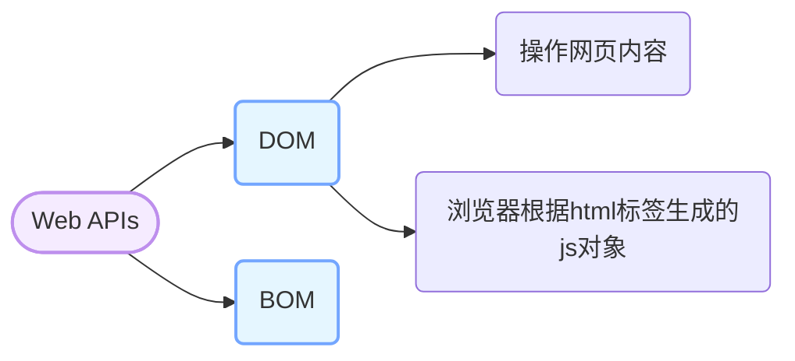

# Web APIs

Web APIs 分为 DOM（文档对象类型）和 BOM（浏览器对象类型）



## DOM

DOM 是浏览器根据 html 标签生成的 js 对象

```html
<div>123</div>
<script>
    const div = document.querySelector('div')
    console.log(div) // 123   dom对象
  console.dir()可以查看对象的所有属性和方法
</script>
```

### 获取 dom 元素

```js
document.querySelector();
document.querySelectorAll();
// 根据id获取一个元素
document.getElementById("nav");
// 根据标签名获取一类元素 获取页面所有div
document.getElementsByTagName("div");
// 根据类名获取元素 获取页面所有类名为w的元素
document.getElementsByClassName("w");
```

### 修改 dom 元素

#### innerText

纯文本，会忽略标签不解析

#### innerHTML

html 标签，会解析标签

### 控制样式属性

#### 修改样式属性

通过元素节点获得的 `style` 属性本身的数据类型也是对象，如 `box.style.color`、`box.style.width` 分别用来获取元素节点 CSS 样式的 `color` 和 `width` 的值。

任何标签都有 `style` 属性，通过 `style` 属性可以动态更改网页标签的样式，如要遇到 `css` 属性中包含字符 `-` 时，要将 `-` 去掉并将其后面的字母改成大写，如 `background-color` 要写成 `box.style.backgroundColor`

#### 修改样式类名

> 1.由于 class 是关键字, 所以使用 className 去代替
>
> 2.className 是使用新值换旧值, 如果需要添加一个类,需要保留之前的类名
>
> 3.  通过 classList 操作类控制 CSS 样式，为了解决 className 容易覆盖以前的类名，可以通过 classList 方式追加和删除类名

```html
<style>
  .pink {
    color: pink;
  }
  .box {
    width: 200px;
    height: 200px;
    background-color: skyblue;
  }
</style>
<div class="box">随便一些文本内容</div>
<script>
  // 获取 DOM 节点
  const box = document.querySelector(".intro");
  box.className = "pink";
  // 如果有两个类名
  box.className = "pink box";
  // 想要添加一个类名, 保留之前的类名
  box.className += " box";

  // 通过 classList 操作类控制CSS样式,类名不加点，直接写类名字符串
  // 追加类名
  box.classList.add("pink");
  // 删除类名
  box.classList.remove("box");
  // 切换类名，如果有就删除，没有就添加
  box.classList.toggle("box");
</script>
```

## 表单

### 操作表单元素属性

获取:DOM 对象.属性名

设置:DOM 对象.属性名= 新值

存在隐式转换，表单属性只接受布尔值

> disabled:禁用
>
> checked:选中
>
> value:值

`<button>` 标签获取值用 .innerHTML
`<input>` 标签获取值用.value
`<li>` 索引从 1 开始

### 自定义属性

data-属性名

在标签上一律以 data-开头

在 DOM 对象上一律以 dataset 对象方式获取

## 定时器-间歇函数

`setInterval` 是 JavaScript 中内置的函数，它的作用是间隔固定的时间自动重复执行另一个函数，也叫定时器函数。

开启定时器

```js
setInterval(函数, 间隔时间);
// 1
setInterval(function () {
  // 要执行的代码
}, 间隔时间);

// 2
function fn() {
  // 要执行的代码
}
setInterval(fn, 间隔时间);
```

作用：每隔指定的时间就会自动执行一次函数，间隔时间单位是毫秒

关闭定时器

```js
定时器变量名 = setInterval(函数, 间隔时间);
clearInterval(定时器变量名);
```

作用：关闭定时器，参数是定时器变量名

## 事件监听

事件监听是一种常见的编程模式，用于在特定事件发生时执行特定的代码块。它可以用于响应用户的交互、网络请求的完成、定时器的触发等各种情况。

**事件监听三要素：**

1. 事件源：触发事件的对象，如按钮、输入框等。
2. 事件类型：触发的事件类型，如点击、输入、滚动等。
3. 事件处理函数：当事件发生时要执行的代码块。

```js
DOM对象.addEventListener(事件类型, 事件处理函数);
```

addListener 方法可以绑定多次，拥有事件更多特性。

### 事件类型

事件类型是指触发事件的类型，如点击、输入、滚动等。

#### 鼠标事件-鼠标触发

| 事件类型   | 描述         |
| ---------- | ------------ |
| click      | 鼠标左键点击 |
| dblclick   | 鼠标左键双击 |
| mousedown  | 鼠标左键按下 |
| mouseup    | 鼠标左键抬起 |
| mouseover  | 鼠标移入     |
| mouseout   | 鼠标移出     |
| mousemove  | 鼠标移动     |
| mouseenter | 鼠标移入元素 |
| mouseleave | 鼠标移出元素 |

> mouseenter 和 mouseleave 事件不会冒泡，不会触发父元素的事件处理函数。即只对本身元素有效。
>
> mouseover 和 mouseout 事件会冒泡，会触发父元素的事件处理函数。即只要经过父元素或者子元素都会触发事件处理函数。

#### 焦点事件-表单获得光标

| 事件类型 | 描述     |
| -------- | -------- |
| focus    | 获得焦点 |
| blur     | 失去焦点 |

#### 键盘事件-键盘触发

| 事件类型 | 描述               |
| -------- | ------------------ |
| keydown  | 键盘按键按下       |
| keyup    | 键盘按键抬起       |
| keypress | 键盘按键按下并释放 |

#### 文本事件-表单输入触发

| 事件类型 | 描述     |
| -------- | -------- |
| input    | 文本输入 |
| change   | 文本改变 |
| select   | 文本选中 |
| submit   | 表单提交 |
| reset    | 表单重置 |

#### 窗口事件-窗口触发

| 事件类型 | 描述         |
| -------- | ------------ |
| load     | 页面加载完成 |
| unload   | 页面卸载     |
| resize   | 窗口大小改变 |
| scroll   | 窗口滚动     |

#### 媒体事件-媒体触发

| 事件类型       | 描述               |
| -------------- | ------------------ |
| play           | 媒体播放           |
| pause          | 媒体暂停           |
| ended          | 媒体播放结束       |
| timeupdate     | 媒体播放时间更新   |
| volumechange   | 媒体音量改变       |
| canplay        | 媒体可以播放       |
| canplaythrough | 媒体可以播放到结尾 |
| waiting        | 媒体等待           |
| seeking        | 媒体正在查找       |
| seeked         | 媒体查找完成       |
| error          | 媒体错误           |
| abort          | 媒体中止           |
| loadedmetadata | 媒体元数据加载完成 |
| loadeddata     | 媒体数据加载完成   |
| loadstart      | 媒体加载开始       |
| durationchange | 媒体时长改变       |
| ratechange     | 媒体播放速率改变   |
| resize         | 媒体大小改变       |

### 事件对象

事件对象是指触发事件时，浏览器会自动创建的一个对象，包含了事件的相关信息，如事件类型、事件源、事件坐标等。

事件对象是一个特殊的对象，它包含了事件的相关信息，如事件类型、事件源、事件坐标等。事件对象是由浏览器自动创建的，不需要我们手动创建。

```javascript
元素.addEventListener(事件类型, function (事件对象) {
  // 事件处理函数
});
```

事件对象的属性和方法：

| 属性      | 描述     |
| -------- | -------- |
| type     | 事件类型 |
| target   | 事件源   |
| currentTarget | 当前事件目标 |
| preventDefault() | 阻止默认行为 |
| stopPropagation() | 阻止事件冒泡 |
| stopImmediatePropagation() | 阻止事件冒泡和默认行为 |
| getModifierState() | 获取修饰键状态 |
| isTrusted | 是否由用户触发 |
| timeStamp | 事件发生的时间戳 |
| pageX | 鼠标相对于页面的X坐标 |
| pageY | 鼠标相对于页面的Y坐标 |
| clientX | 鼠标相对于客户端的X坐标 |
| clientY | 鼠标相对于客户端的Y坐标 |
| screenX | 鼠标相对于屏幕的X坐标 |
| screenY | 鼠标相对于屏幕的Y坐标 |
| key | 键盘按键的键值 |
| code | 键盘按键的键码 |
| keyCode | 键盘按键的键值 |
| charCode | 键盘按键的字符码 |
| which | 键盘按键的键值 |
| altKey | 是否按下Alt键 |
| ctrlKey | 是否按下Ctrl键 |
| shiftKey | 是否按下 Shift键 |
| metaKey | 是否按下Meta键 |
| detail | 鼠标滚轮滚动的距离 |
| data | 文本输入的数据 |
| value | 表单元素的值 |
| checked | 复选框是否选中 |
| selected | 下拉框是否选中 |
| rows | 文本框的行数 |
| cols | 文本框的列数 |
| width | 媒体元素的宽度 |
| height | 媒体元素的高度 |
| volume | 媒体元素的音量 |
| rate | 媒体元素的播放速率 |
| currentTime | 媒体元素的当前播放时间 |
| duration | 媒体元素的总时长 |
| paused | 媒体元素是否暂停 |
| ended | 媒体元素是否播放结束 |
| seeking | 媒体元素是否正在查找 |
| seekable | 媒体元素是否可以查找 |
| buffered | 媒体元素已经缓冲的时间范围 |
| networkState | 媒体元素的网络状态 |
| readyState | 媒体元素的准备状态 |

### 环境对象
环境对象是指触发事件时，浏览器会自动创建的一个对象，包含了事件的相关信息，如事件类型、事件源、事件坐标等。

指的是函数内部特殊的变量this，代表当前函数运行时所处的环境

### 回调函数
回调函数是指在一个函数中调用另一个函数，被调用的函数就是回调函数。回调函数通常用于异步操作，如定时器、事件监听、ajax 请求等。

回调函数的优点是可以将代码分离，提高代码的可读性和可维护性。

```javascript
function fn(callback) {
  console.log("我是回调函数")
}
setInterval(fn, 1000);
```


## 属性选择器

属性选择器是一种 CSS 选择器，用于选择具有特定属性的元素。它可以根据元素的属性值来选择元素，例如根据元素的 class、id、type 等属性来选择元素。

属性选择器的语法如下：

```css
[属性名] {
  属性值: 属性值;
}
```

属性选择器的优点是可以根据元素的属性值来选择元素，从而实现更加灵活的样式控制。

```javascript
const input = document.querySelector("[type=search]");
const resultList = document.querySelector(".result-list");
input.addEventListener("focus", function () {
  ul.style.display = "block";
  input.classList.add("search");
});
```

## 伪类选择器
伪类选择器是一种 CSS 选择器，用于选择元素的特定状态。它可以根据元素的状态来选择元素，例如根据元素的位置、状态、类型等来选择元素。

伪类选择器的语法如下：

```css
元素名:伪类名 {
  属性值: 属性值;
}
```

伪类选择器的优点是可以根据元素的状态来选择元素，从而实现更加灵活的样式控制。

## trim
trim() 方法用于删除字符串的头尾空白符，空白符包括：空格、制表符 tab、换行符等其他空白符等。

trim() 方法不会改变原始字符串。

trim() 方法返回一个新的字符串，该字符串是原始字符串的副本，其中所有的头尾空白符都已被删除。

```javascript
const str = "  Hello World!  ";
const trimmedStr = str.trim();
console.log(trimmedStr); // "Hello World!"
```
