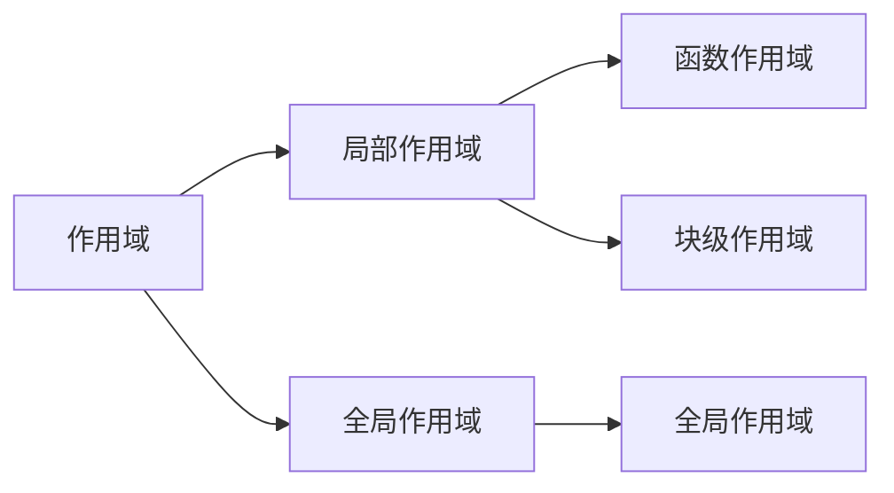
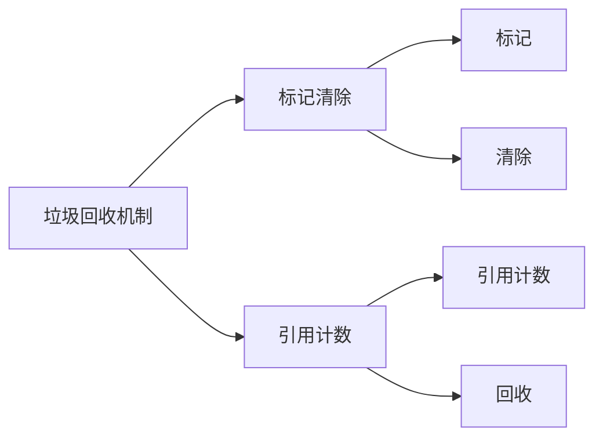

# JS 进阶

## 作用域



## 垃圾回收机制



### 内存的生命周期

js 环境分配的内存，一般有如下生命周期：

1. 内存分配：当程序需要使用内存时，操作系统会向 js 分配内存。
2. 内存使用：分配的内存可以用于存储数据和执行代码。
3. 内存释放：当程序不再需要使用内存时，操作系统会将其释放回可用内存池中。

全局变量一般不会被垃圾回收机制回收，因为全局变量在整个程序运行期间都存在。（关闭页面回收）

一般情况下局部变量的值，不用就会被自动回收掉

### 内存泄漏

程序中分配的内存由于某种原因无法被释放，导致内存占用越来越多，最终导致程序崩溃。

### 闭包

闭包=内层函数+外层函数的变量

## 函数

### 动态参数

当不确定函数参数个数时，可以使用动态参数

```javascript
function getSum() {
  // arguments 动态参数 只存在于 函数里面
  // 是伪数组 里面存储的是传递过来的实参
  // console.log(arguments)  [2,3,4]
  let sum = 0;
  for (let i = 0; i < arguments.length; i++) {
    sum += arguments[i];
  }
  console.log(sum);
}
getSum(2, 3, 4);
getSum(1, 2, 3, 4, 2, 2, 3, 4);
console.log(sum(1, 2, 3, 4, 5)); // 输出：15
```

arguments 是伪数组，只存在函数中

### 剩余参数

只接受最末尾的参数,是真数组

```javascript
function getSum(a, b, ...arr) {
  console.log(arr); // 使用的时候不需要写 ...
}
getSum(2, 3);
getSum(1, 2, 3, 4, 5);
```

## 展开运算符

`...arr`

## 箭头函数

替代原本需要匿名函数的地方

```javascript
// 匿名函数
let fn = function () {
  console.log("hello");
};
fn();
```

```javascript
// 箭头函数
let fn = () => {
  console.log("hello");
};
fn();
```

### 箭头函数的简写

1. 当函数体只有一行代码时，可以省略大括号

   ````javascript
   let fn = () => console.log("hello");
   fn();   ```

   ````

2. 当函数体只有一行代码，且这行代码是 return 语句时，可以省略 return

   ````javascript
   let fn = (a, b) => a + b;
   console.log(fn(1, 2));   ```

   ````

3. 当函数只有一个参数时，可以省略小括号

   ```javascript
   let fn = (a) => a + 1;
   console.log(fn(1));
   ```

### 箭头函数的 this

箭头函数的 this 指向的是函数定义时的 this，而不是函数调用时的 this。

箭头函数不会创建自己的 this，只会从自己的作用域链的上一层继承 this。

时间回调函数使用箭头函数时，this 指向的是 window。使用 DOM 事件回调函数不推荐使用箭头函数

## 解构赋值

### 数组解构

将数组的单元值赋值给变量

```javascript
let arr = [1, 2, 3];
let [a, b, c] = arr;
console.log(a); // 1
console.log(b); // 2
console.log(c); // 3
```

**js 前必须加分号情况**

1. 立即执行函数

```javascript
(function t() {})();

(function t() {})();
```

2. 数组解构

```javascript
[a, b] = [b, a];
```

- 变量多，单元值少

```javascript
let arr = [1, 2, 3];
let [a, b, c, d] = arr;
console.log(a); // 1
console.log(b); // 2
console.log(c); // 3
console.log(d); // undefined
```

- 变量少，单元值多

```javascript
let arr = [1, 2, 3];
let [a, b] = arr;
console.log(a); // 1
console.log(b); // 2
```

- 变量多，单元值少，剩余参数

```javascript
let arr = [1, 2, 3];
let [a, b, ...c] = arr;
console.log(a); // 1
console.log(b); // 2
console.log(c); // [3]
```

- 变量少，单元值多，剩余参数

```javascript
let arr = [1, 2, 3];
let [a, b] = arr;
console.log(a); // 1
console.log(b); // 2
```

为了防止 undifineded 报错，需要给变量设置默认值

```javascript
let arr = [1, 2, 3];
let [a, b, c = 4] = arr;
console.log(a); // 1
console.log(b); // 2
console.log(c); // 3
```

### 对象解构

属性名和变量名一致

```javascript
let obj = {
  name: "pink",
  age: 18,
};
let { name, age } = obj;
console.log(name); // pink
console.log(age); // 18
```

对象解构的变量名可以改名
`旧变量名：新变量名`
```javascript
const name = "black";
let obj = {
  name: "pink",
  age: 18,
};
let { name: n, age: a } = obj;
console.log(n); // pink
console.log(a); // 18
```
## map forEach
### map

map 方法会返回一个新数组，数组中的元素为原始数组元素调用函数处理后的值。

map 方法按照原始数组元素顺序依次处理元素。

map 方法不会对空数组进行检测。

map 方法不会改变原始数组。

```javascript
let arr = [1, 2, 3];
let newArr = arr.map(function (item) {
  return item * 2; 
})
console.log(newArr); // [2, 4, 6]
```

### forEach

forEach 方法用于调用数组的每个元素，并将元素传递给回调函数。

forEach 方法按照原始数组元素顺序依次处理元素。

forEach 方法不会对空数组进行检测。

forEach 方法不会改变原始数组。

```javascript
let arr = [1, 2, 3];
arr.forEach(function (item) {
  console.log(item); 
})
```
